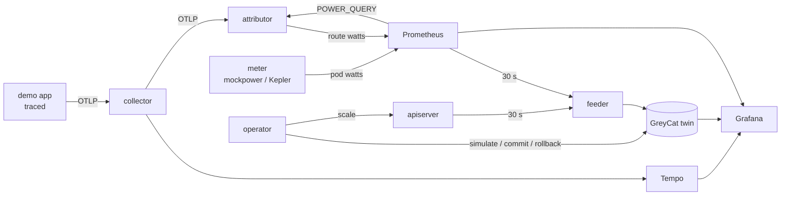

# Wattopus

Energy attribution for Kubernetes, per **traced request path**, driven through a **digital twin**. A research proof of concept: every component is Rust, the twin is [GreyCat](https://greycat.io), everything else (Prometheus, Tempo, Grafana,  OpenTelemetry Collector) is storage or transport.

## Introduction

Wattopus answers two questions a Kubernetes cluster cannot answer today:

1. **Who consumes the watts?** Not per node, not per pod — per *business request path* (`/checkout`, `/report`, …), across every service a request traverses.
2. **What would this change cost before I apply it?** Scaling decisions go through a live digital twin of the cluster: simulate, check the requirement, then apply — or roll back without touching production.

It runs on a laptop (kind, deterministic mock meter) or on real hardware (Grid'5000, real watts via RAPL).

## Identified issue

Kubernetes observability is resource-centric: CPU, memory, network per pod.
Power meters, when present at all, stop one level too high: a wattmeter or a BMC gives watts per *node*; software meters like Kepler give watts per *pod*. Nobody bills the *request*. Yet the request path is the unit that maps to business value — "what does a checkout cost in joules?" is the question behind energy-aware pricing, frugal scaling and carbon reporting.

Two things make the naive answers wrong:

- **Leakage.** Splitting node power by CPU share loses energy on the floor: shared services, idle draw, untraced traffic. A attribution that does not *conserve* power (Σ attributed == Σ measured) is an estimate you cannot audit.
- **Blind actuation.** Even with good measurements, operators change clusters open-loop: scale up, watch dashboards, apologize. The energy consequence of a change is discovered after the fact.

## Concept of solution

**Attribution that conserves power.** Every pod's measured watts are distributed over the request routes that traversed it, weighted by trace-derived work. What no trace explains stays visible in an `_unattributed` bucket instead of disappearing. 
**A twin in the loop.** A feeder posts the full cluster picture (nodes, namespaces, deployments, services, pods, containers — usage, availability, joules) to GreyCat every tick as temporal series. A predictor writes quiescence verdicts next to the data. The operator never scales the cluster directly: it asks the twin to *simulate* the change, checks the predicted metrics against the requirement, and only then touches the apiserver — otherwise it rolls the twin back and answers "no, because...". 
**The meter is a module.** The only coupling between "where watts come from" and everything else is one PromQL query (`POWER_QUERY`) returning `(namespace, pod) -> watts`  


## Cluster deployment (Grid'5000 / kube5k)

Prerequisites: a kubeconfig for the cluster, `kubectl`, `helm`.
Images are pulled from `docker.io/inkedstinct/*` at the tag pinned in the
manifests.

```sh
export KUBECONFIG=$PWD/deploy/cluster/admin_kube5k.conf

make deploy-storage           # install local-path-provisioner 
kubectl apply -k deploy/g5k   # the stack, Kepler POWER_QUERY, no mockpower
make deploy-kepler            # the meter: upstream OCI chart, RAPL DaemonSet
make deploy-rust-demo         # demo workload + load generator
make demo                     # (optionnal): fire /checkout /catalog /report once
```


Delete: `make undeploy-rust-demo undeploy-base undeploy-kepler` 

## Local deployment (kind)

```sh
make build-kind            # kind cluster from deploy/local/kind.yaml
make build                 # all images, TAG from the Makefile
TAG=0.2.0                  # match the Makefile / manifests
for i in app attributor feeder operator mockpower predictor greycat-twin kubediagram; do
  kind load docker-image inkedstinct/$i:$TAG -n wattopus
done
kubectl apply -k deploy/   # base profile: the stack + mockpower
make deploy-rust-demo
make demo
```


Dev loop without a cluster:
```sh
make test                  # cargo workspace tests, incl. the contract fixture
cd greycat && greycat serve --user=1 &   # a live twin on :8080
make contract              # fire the golden fixture at it
```

Delete: `make delete-kind`.
